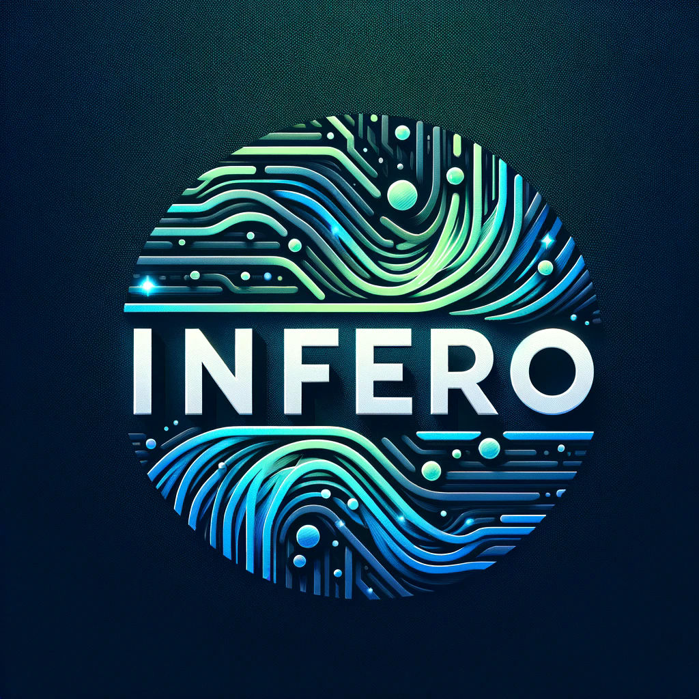

This project is no longer activity maintained. Development has now moved to https://github.com/tinyBigGAMES/Lumina



[](https://discord.gg/tPWjMwK) [](https://twitter.com/tinyBigGAMES)
# Infero
###  Overview
A streamlined and user-friendly library designed for performing local LLM inference directly through your preferred programming language. This library efficiently loads LLMs in [GGUF format](https://huggingface.co/docs/hub/gguf) into CPU or GPU memory, utilizing a [CUDA backend](https://blogs.nvidia.com/blog/what-is-cuda-2/) for enhanced processing speed.

###  Installation
- Download the [Infero](https://github.com/tinyBigGAMES/Infero/archive/refs/heads/main.zip) repo.
- Download the Infero [Runtime](https://github.com/tinyBigGAMES/Infero/releases/tag/v1.0.0) dependencies, `CUDA` and `llama`. These DLLs must be present on your target device for Infero to function properly. Please ensure they are placed in the same directory as your Infero executable file.
- Acquire a GGUF model. All vetted models compatible with Infero can be downloaded from our <a href="https://huggingface.co/tinybiggames" target="_blank">Hugging Face</a> account.
- The application utilizes CUDA for enhanced performance on supported [GPUs](docs/gpu.md). Ensure the model size does not exceed the available system resources, considering the requisite memory.
- Consult the `installdir\examples` directory for demonstrations on integrating **Infero** with your programming language.
- Include the following DLLs in your project distribution: `CUDA runtime`, `llama runtime`, and `Infero.dll`.
- Infero API supports integration across programming languages that accommodate Win64 and Unicode, with out-of-the-box support for Pascal and C/C++.
- Ship-ready DLLs are included in the repository; however, if there is a need to rebuild the `Infero.dll`, Delphi 12.1 is required.
- This project is developed using RAD Studio 12.1, on Windows 11, powered by an Intel Core i5-12400F at 2500 MHz with 6 cores (12 logical), equipped with 36GB RAM and an NVIDIA RTX 3060 GPU with 12GB VRAM.

- We encourage testing and welcome pull requests.
- If you find this project beneficial, please consider starring the repository, sponsoring, or promoting it. Your support is invaluable and highly appreciated.
 
###  Examples  
Pascal example:
```Delphi   
uses
  SysUtils,
  Infero;

begin
  // init config
  InitConfig('C:\LLM\gguf', -1);
  
  // define model
  DefineModel('phi-3-mini-4k-instruct.Q4_K_M.gguf',
    'phi-3-mini-4k-instruct.Q4_K_M', 4000,
    '<|{role}|>{content}<|end|>', '<|assistant|>');  
    
  // add messages
  AddMessage(ROLE_SYSTEM, 'You are a helpful AI assistant.');
  AddMessage(ROLE_USER, 'What is AI?');
  
  // load model
  if not LoadModel('phi-3-mini-4k-instruct.Q4_K_M') then Exit;

  // run inference
  if RunInference('phi-3-mini-4k-instruct.Q4_K_M', 1024) then
    begin
      // success
    end
 else
   begin
     // error
   end;
 
  // unload mode
  UnloadModel();
end.
```  
C/CPP Example  
```CPP  
#include <Infero.h>

int main()
{
    // init config
    InitConfig('C:/LLM/gguf', -1);
  
    // define model
    DefineModel(L"phi-3-mini-4k-instruct.Q4_K_M.gguf",
      L"phi-3-mini-4k-instruct.Q4_K_M", 4000,
      L"<|{role}|>{content}<|end|>", L"<|assistant|>");  
    
    // add messages
    AddMessage(ROLE_SYSTEM, L"You are a helpful AI assistant.");
    AddMessage(ROLE_USER, L"What is AI?");
  
    // load model
    if (!LoadModel(L"phi-3-mini-4k-instruct.Q4_K_M")) return 1;

    // run inference
    if (RunInference(L"phi-3-mini-4k-instruct.Q4_K_M", 1024))
    {
        // success
    }
    else
    {
        // error
    }
 
    // unload mode
    UnloadModel();
    
    return 0;
}
```

###  Media


###  Support
Our development motto: 
- We will not release products that are buggy, incomplete, adding new features over not fixing underlying issues.
- We will strive to fix issues found with our products in a timely manner.
- We will maintain an attitude of quality over quantity for our products.
- We will establish a great rapport with users/customers, with communication, transparency and respect, always encouragingng feedback to help shape the direction of our products.
- We will be decent, fair, remain humble and committed to the craft.

###  Links
- <a href="https://github.com/tinyBigGAMES/Infero/issues" target="_blank">Issues</a>
- <a href="https://github.com/tinyBigGAMES/Infero/discussions" target="_blank">Discussions</a>
- <a href="https://discord.gg/tPWjMwK" target="_blank">Discord</a>
- <a href="https://www.facebook.com/groups/infero" target="_blank">Facebook Group</a>
- <a href="https://www.reddit.com/r/Infero/" target="_blank">Reddit</a>
- <a href="https://youtube.com/tinyBigGAMES" target="_blank">YouTube</a>
- <a href="https://twitter.com/tinyBigGAMES" target="_blank">X (Twitter)</a>
- <a href="https://tinybiggames.com/" target="_blank">tinyBigGAMES</a>


###  License
Infero is a community-driven project created by <a href="https://github.com/tinyBigGAMES" target="_blank">tinyBigGAMES LLC</a>.

BSD-3-Clause license - Core developers:
- <a href="https://github.com/jarroddavis68" target="_blank">Jarrod Davis</a>

###  Acknowledgments
Infero couldn't have been built without the help of wonderful people and great software already available from the community. **Thank you!**

Software
- [llama.cpp](https://github.com/ggerganov/llama.cpp). 

People
- John Claw
- Robert Jalarvo

Contributors

<a href="https://github.com/tinyBigGAMES/Infero/graphs/contributors">
  
</a>


